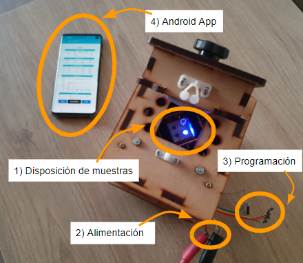

# OS-LAMP
This project aim to build a opensource, low cost and portable machine able to carry out LAMP/RT-LAMP reactions and record the output signal in **real time**.

Properties:
- very low cost
- controled by an Android app
- slots for 4 samples
- continuos fluorescence measurement
- hot lid to avoid the usage of mineral oil in the samples

## Fluorescent system
Each slot is illumianted independently by a 470 nm Blue LED and its output fluorescence is filtered with an acrylic ambar filter.

## General system description

